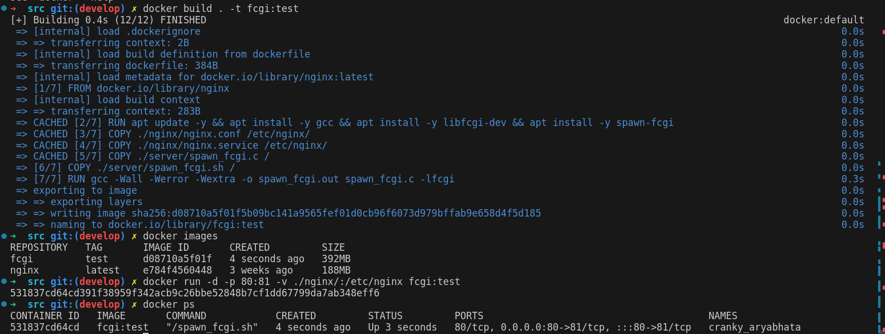

## Part 1. Готовый докер
* Берём официальный докер-образ с nginx и скачиваем его при помощи 'docker pull'.
* 
* Проверяем наличие докер-образа через 'docker images'.
* 
* Запускаем докер-образ через 'docker run -d [image_id|repository]'. Проверяем, что образ запустился через 'docker ps'.
* 
* Смотрим информацию о контейнере через 'docker inspect [container_id|container_name]'. По выводу команды определяем размер контейнера:
* 
* Список замапленных портов и ip контейнера:
* 
* Останавливаем докер образ через 'docker stop [container_id|container_name]'. Проверяем, что образ остановился через 'docker ps'.
* 
* Запускаем докер с портами 80 и 443 в контейнере, замапленными на такие же порты на локальной машине, через команду 'docker run -d -p [port:port]'.
* 
* Проверяем, что в браузере по адресу localhost:80 доступна стартовая страница nginx.
* 
* Перезапускаем докер контейнер через 'docker restart [container_id|container_name]'.
* 
## Part 2. Операции с контейнером
* Прочитаем конфигурационный файл '/etc/nginx/nginx.conf' внутри докер контейнера через команду 'docker exec [container_id|container_name] [command]'.
* 
* 
* 
* 
* 
* 
* 
* 
* 
* 
* 
## Part 3. Мини веб-сервер
* 
* 
## Part 4. Свой докер
* 
* 
## Part 5. Dockle
* 
* 
## Part 6. Базовый Docker Compose
* 
* 