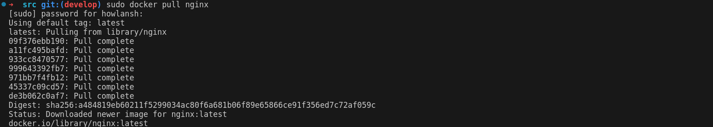

## Part 1. Готовый докер
* Берём официальный докер-образ с nginx и скачиваем его при помощи 'docker pull'.
* 
* Проверяем наличие докер-образа через 'docker images'.
* 
* Запускаем докер-образ через 'docker run -d [image_id|repository]'. Проверяем, что образ запустился через 'docker ps'.
* 
* Смотрим информацию о контейнере через 'docker inspect [container_id|container_name]'. По выводу команды определяем размер контейнера:
* 
* Список замапленных портов и ip контейнера:
* 
* Останавливаем докер образ через 'docker stop [container_id|container_name]'. Проверяем, что образ остановился через 'docker ps'.
* 
* Запускаем докер с портами 80 и 443 в контейнере, замапленными на такие же порты на локальной машине, через команду 'docker run -d -p [port:port]'.
* 
* Проверяем, что в браузере по адресу localhost:80 доступна стартовая страница nginx.
* 
* Перезапускаем докер контейнер через 'docker restart [container_id|container_name]'.
* 
## Part 2. Операции с контейнером
* Прочитаем конфигурационный файл '/etc/nginx/nginx.conf' внутри докер контейнера через команду 'docker exec [container_id|container_name] [command]'.
* 
* Создаём на локальной машине файл "nginx.conf". Настриваем в нём по пути "/status" отдачу страницы статуса сервера nginx.
* 
* Скопируем созданный файл "nginx.conf" внутрь докер-образа через команду 'docker cp [file] [container_id]:[path]'.
* 
* Перезапускаем nginx внутри докер-образа через команду 'docker exec nginx -s reload'.
* 
* По адресу "localhost:80/status" открываем страничку со статусом сервера nginx.
* 
* Через 'docker inspect [container_id]' проверим команды, выполняемые при запуске, docker export не экспортирует всю информацию о контейнере — только файловую систему.
* 
* Экспортируем контейнер в файл "container.tar" через команду 'docker export -o [filename.tar] [container_id]'. Останавливаем контейнер.
* 
* Удаляем образ через 'docker rmi -f [image_id|repository]'. Флаг 'f', чтобы не удалять перед этим контейнеры. Потом удаляем остановленный контейнер через 'docker rm [container_id].
* 
* Итак, при импорте дампа обратно в новый образ докера необходимо указать дополнительные флаги для воссоздания контекста. Импортируем контейнер обратно через команду 'docker import --change 'CMD [startup_command]' [filename.tar] [name]'. Запускаем импортированный контейнер как обычно.
* 
* Проверяем ещё раз "localhost:80/status".
* 